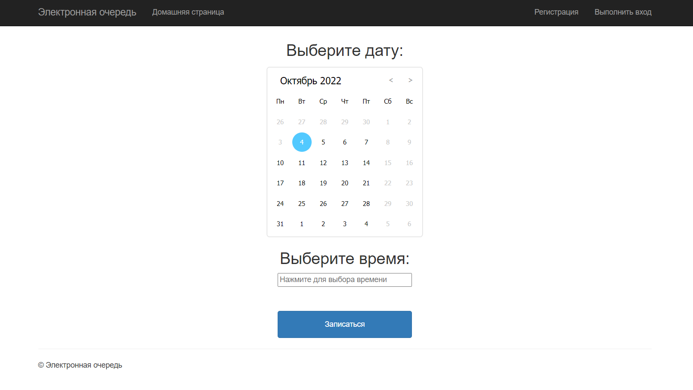

# Информационная Система Электронной Очереди на ASP.NET 

## Настройка
 - В файле `Web.config` изменить строку подключения на `12` строке.
```xml
<add name="DefaultConnection" connectionString="Server=YOUR_CONNECTION_STRING;Database=WebQueue;Trusted_Connection=True;" providerName="System.Data.SqlClient"/>
```
 - В файле `Web.config` указать данные для подключения к SMTP серверу начиная с `19` строки.
```xml
<add key="Email" value="YOUR_EMAIL"/>
<add key="Email_Smtp" value="smtp.gmail.com"/>
<add key="Email_Smtp_Port" value="587"/>
<add key="Email_Password" value="YOUR_EMAIL_PASSWORD"/>
  ```
### Стандартные данные учётной записи администратора: 
   - Email: `Admin@admin.com`
   - Password: `Admin123@`
 
  
